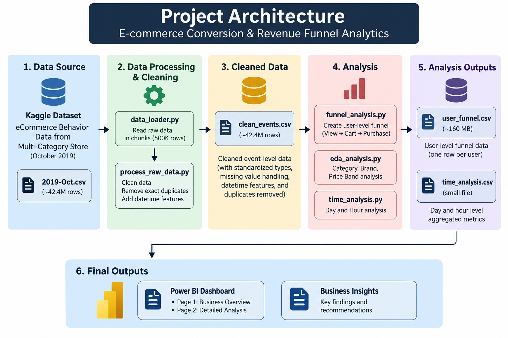
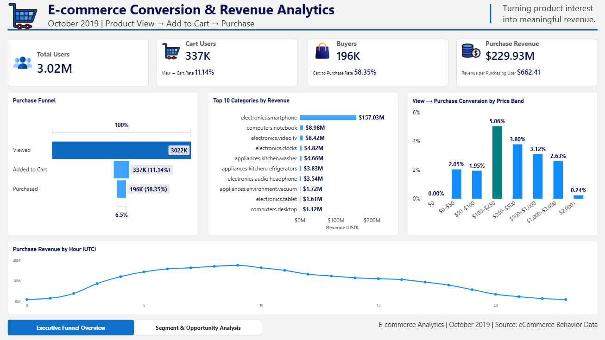
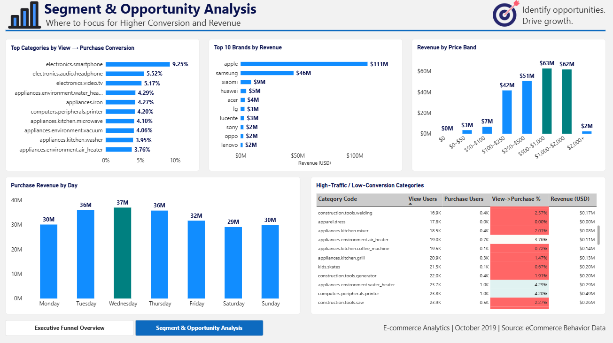

# E-commerce Conversion & Revenue Funnel Analytics

> A portfolio project demonstrating large-scale e-commerce event processing, chronological funnel analysis, segmentation, revenue analysis, data validation, and Power BI dashboarding using Python and Pandas.

## 📌 Project Overview

E-commerce businesses generate large volumes of customer interaction data, but raw event logs do not directly explain how users progress from product discovery to purchase.

This project analyzes the customer journey through:

```text
Product View → Add to Cart → Purchase
```

Using the October 2019 e-commerce event dataset, the project transforms **42.4M+ event records** into validated analytical datasets and a focused two-page Power BI dashboard.

The analysis focuses on:

- Funnel conversion and drop-off
- Category performance
- Brand performance
- Price-band behavior
- Time-based conversion and purchase activity
- Revenue contribution
- High-traffic / low-conversion opportunities
- Business recommendations

The project deliberately focuses on practical **Data Analyst** skills rather than machine learning or predictive modeling.

---

## 🎯 Business Problem

An e-commerce company receives a large volume of product interactions, but management does not have a clear understanding of how users move from product discovery to purchase.

The business wants to:

1. Identify where customers drop out of the purchase funnel.
2. Measure conversion between funnel stages.
3. Understand which categories perform strongly or weakly.
4. Identify brands that contribute significant revenue.
5. Understand conversion behavior across price ranges.
6. Determine when users convert most effectively.
7. Identify high-traffic segments with weak conversion.
8. Quantify revenue contribution and prioritize business opportunities.

## 🎯 Project Objective

> **Identify major funnel bottlenecks, quantify their impact on conversion and revenue, understand segment-level performance, and provide actionable recommendations for improving e-commerce conversion.**

---

# 🔎 Business Questions

### Funnel Performance
- How many unique users reach each funnel stage?
- What is the View → Cart conversion rate?
- What is the Cart → Purchase conversion rate?
- What is the overall View → Purchase conversion rate?
- Which funnel stage has the largest drop-off?

### Category Analysis
- Which categories generate the most revenue?
- Which categories have the strongest View → Purchase conversion?
- Which high-traffic categories have weak conversion?
- Where are the largest category-level optimization opportunities?

### Brand Analysis
- Which brands generate the most revenue?
- Which brands have strong funnel conversion?
- Which brands combine significant traffic with strong revenue contribution?

### Price Analysis
- How does conversion vary across price bands?
- Which price range has the highest View → Purchase conversion?
- Which price ranges contribute the most revenue?
- Does very high-priced merchandise show weaker conversion?

### Time Analysis
- When do users entering the funnel convert most effectively?
- Which day of the week has the strongest conversion?
- When is actual purchase revenue highest?
- Do conversion efficiency and revenue volume peak at the same time?

---

# 📊 Dataset

## Source

**eCommerce Behavior Data from Multi-Category Store**

[Kaggle Dataset](https://www.kaggle.com/datasets/mkechinov/ecommerce-behavior-data-from-multi-category-store)

### Dataset Used

```text
2019-Oct.csv
```

### Period

```text
October 2019
```

### Dataset Scale

| Metric | Value |
|---|---:|
| Raw event records | 42,448,764 |
| Clean event records | 42,418,544 |
| Unique users | 3,022,290 |
| Unique products | 166,794 |
| Unique categories | 624 |
| Purchase events after deduplication | 742,773 |
| Purchase-event revenue | $229.93M |

> The raw dataset is approximately 5.25 GB and is **not included in this repository** because of its size.

## Raw Dataset Columns

| Column | Description |
|---|---|
| `event_time` | Timestamp when the user event occurred |
| `event_type` | Type of e-commerce interaction |
| `product_id` | Unique product identifier |
| `category_id` | Unique category identifier |
| `category_code` | Hierarchical product category |
| `brand` | Product brand |
| `price` | Product price associated with the event |
| `user_id` | Unique user identifier |
| `user_session` | User session identifier |

See [`docs/data_dictionary.md`](docs/data_dictionary.md) for complete definitions.

---

# 🧭 Funnel Definition

The primary funnel is:

```text
View
  ↓
Add to Cart
  ↓
Purchase
```

Funnel conversion is calculated using **unique users**, not raw event counts.

### Chronological Funnel Rule

A cart qualifies only after a previous view.

A funnel purchase qualifies only after a previous qualifying cart.

Therefore:

```text
View
  ↓
Cart after View
  ↓
Purchase after Cart
```

This prevents unrelated or out-of-order events from being counted as successful funnel progression.

---

# 💰 Revenue Definition

The project deliberately distinguishes **funnel progression** from **purchase-event revenue**.

### Funnel `purchased`

Represents users who completed the chronological:

```text
View → Cart → Purchase
```

sequence.

### `purchase_count`

Represents all purchase events associated with a user.

### `purchase_revenue`

Represents total revenue from those purchase events.

Therefore, users with any purchase event can outnumber users who qualify as funnel purchasers.

Revenue is reported as **purchase-event revenue**, not as formally defined order-level AOV, because the project does not establish a unique order identifier.

---

# 🧹 Data Cleaning & Processing

Because the dataset contains more than 42 million events, the project uses **chunk-based processing**.

## Chunk Processing

The raw CSV is processed in chunks of:

```text
500,000 rows
```

```text
Raw CSV
   ↓
500K-row chunk
   ↓
Process
   ↓
Store required state
   ↓
Next 500K-row chunk
   ↓
Repeat
```

This reduces memory requirements while allowing the complete dataset to be processed.

## Missing Values

Missing descriptive fields are retained and represented as:

```text
Unknown
```

for:

- `category_code`
- `brand`
- `user_session`

Rows are not removed simply because descriptive fields are missing.

## Zero-Price Records

The raw dataset contains:

```text
68,673 zero-price records
```

| Event Type | Zero-Price Records |
|---|---:|
| View | 68,523 |
| Cart | 150 |
| Purchase | 0 |

Zero-price records are retained in the event dataset but treated separately in price-band analysis.

---

# 🔁 Duplicate Handling

Exact duplicate events are removed during production processing.

An exact duplicate is defined using all original event columns:

```text
event_time
event_type
product_id
category_id
category_code
brand
price
user_id
user_session
```

Only exact duplicates are removed. **Legitimate repeated user behavior is retained.**

### Production Result

| Metric | Result |
|---|---:|
| Input rows | 42,448,764 |
| Output rows | 42,418,544 |
| Duplicates removed | 30,220 |
| Duplicate removal rate | 0.0712% |

A disk-backed SQLite index tracks event fingerprints across chunks.

---

# 🏗️ Project Architecture



See [`docs/code_documentation.md`](docs/code_documentation.md) for detailed source-code responsibilities.

---

# 🐍 Python Analysis

Python is used for:

- Large-scale data loading
- Data cleaning
- Global deduplication
- User-level funnel construction
- Category analysis
- Brand analysis
- Price-band analysis
- Time analysis
- Output validation

### Technologies

```text
Python
Pandas
NumPy
SQLite
Jupyter Notebook
```

---

# 🗄️ Why SQLite?

SQLite is used as a **temporary persistent state store** during large-scale processing.

```text
duplicate_index.db
    → Event fingerprint tracking

user_funnel.db
    → User funnel state

category_funnel.db
    → User-category state

brand_funnel.db
    → User-brand state

price_band_funnel.db
    → User-price-band state
```

These databases support processing and are not the final analytical layer.

---

# 📁 Analytical Outputs

| Dataset | Grain | Purpose |
|---|---|---|
| `clean_events.csv` | Event | Cleaned event-level dataset |
| `user_funnel.csv` | User | Overall chronological funnel |
| `category_analysis.csv` | Category | Category funnel and revenue |
| `brand_analysis.csv` | Brand | Brand funnel and revenue |
| `price_band_analysis.csv` | Price Band | Price-level funnel and revenue |
| `time_analysis.csv` | Time Bucket | Funnel cohort and purchase activity |

---

# 📈 Analysis Performed

## 1. Overall Funnel Analysis

| Metric | Result |
|---|---:|
| Viewed users | 3,022,130 |
| Added-to-cart users | 336,764 |
| Funnel purchasers | 196,488 |
| View → Cart | 11.14% |
| Cart → Purchase | 58.35% |
| View → Purchase | 6.50% |

### Main Finding

**View → Cart is the primary funnel bottleneck.**

Only 11.14% of viewed users add a product to cart, compared with 58.35% Cart → Purchase conversion.

## 2. Category Analysis

Category performance is analyzed using:

- View users
- Cart users
- Purchase users
- View → Cart conversion
- Cart → Purchase conversion
- View → Purchase conversion
- Purchase events
- Revenue

### Key Finding

`electronics.smartphone` combines scale, conversion, and revenue:

- Approximately **1.30M view users**
- Approximately **9.25% View → Purchase**
- Approximately **$157.0M revenue**

Category-level user totals should not be summed to reproduce overall unique users because a user can interact with multiple categories.

## 3. Brand Analysis

Brand analysis tracks behavior at the user + brand level.

### Leading Revenue Contributors

| Brand | Approx. Revenue |
|---|---:|
| Apple | $111.2M |
| Samsung | $46.4M |
| Xiaomi | $9.2M |

## 4. Price Band Analysis

All monetary values are presented in **USD**.

```text
$0
$0–$50
$50–$100
$100–$250
$250–$500
$500–$1,000
$1,000–$2,000
$2,000+
```

### Key Findings

- `$100–$250` has the highest View → Purchase conversion at approximately **5.06%**.
- `$500–$1,000` generates approximately **$62.9M**.
- `$1,000–$2,000` generates approximately **$62.0M**.
- `$2,000+` has approximately **0.24% View → Purchase** conversion.

## 5. Time Analysis

Time analysis uses two perspectives.

### Funnel Cohort

Users are grouped by their **first product-view timestamp** to measure eventual conversion.

### Purchase Activity

Actual purchase events are grouped by their **purchase timestamp** to measure purchasing activity and revenue.

### Key Findings

- Tuesday has the strongest daily first-view cohort View → Purchase conversion at approximately **7.29%**.
- Wednesday generates the highest actual purchase revenue at approximately **$37.06M**.
- Around **09:00 UTC** has approximately **7.71%** first-view cohort conversion and approximately **$17.55M** hourly purchase revenue.

This demonstrates that **conversion efficiency and revenue volume can peak at different times**.

---

# 💡 Key Business Insights

### 1. The largest opportunity is View → Cart

The business has substantial product-view activity, but only 11.14% of viewed users add products to cart.

**Recommendation:** Focus on product-page and add-to-cart experience optimization.

### 2. Smartphones are a major revenue driver

Smartphones combine large traffic volume, strong conversion, and approximately $157M in revenue.

**Recommendation:** Protect strong-performing merchandising practices and investigate what contributes to their performance.

### 3. High traffic does not guarantee strong conversion

Some categories attract significant viewing traffic but convert below the overall 6.50% View → Purchase benchmark.

**Recommendation:** Prioritize high-traffic / low-conversion categories for targeted investigation and experimentation.

### 4. Revenue and conversion require different optimization strategies

The `$100–$250` segment has the strongest conversion, while higher price bands generate substantial revenue.

**Recommendation:** Evaluate both conversion efficiency and revenue contribution when prioritizing segments.

### 5. Very high-priced products show weak conversion

The `$2,000+` band converts at approximately 0.24%.

**Recommendation:** Investigate possible barriers such as pricing, trust, product information, payment flexibility, and purchase friction.

These are hypotheses, not proven causes.

### 6. Revenue is concentrated among leading brands

Apple, Samsung, and Xiaomi are major revenue contributors.

**Recommendation:** Maintain appropriate merchandising and inventory attention around important revenue-driving brands.

### 7. Timing should consider both conversion and revenue

Tuesday leads on conversion efficiency, while Wednesday leads on revenue.

**Recommendation:** Campaign and operational planning should consider both conversion and revenue volume.

---

# 🎯 Priority Recommendations

1. **Improve View → Cart conversion** through product-page and add-to-cart experience optimization.
2. **Prioritize high-traffic, low-conversion categories** for targeted investigation and experimentation.
3. **Protect high-performing categories and brands** while studying practices associated with stronger conversion.
4. **Investigate high-price conversion barriers**, especially in the `$2,000+` segment.
5. **Use time-based patterns** to support campaign timing and operational planning.

---

# 📊 Power BI Dashboard

The project includes a **two-page Power BI dashboard** designed for executive and business analysis.

## Page 1 — Executive Funnel Overview

Focus:

- Overall user funnel
- Funnel conversion
- Purchase revenue
- Top categories by revenue
- Price-band conversion
- Hourly purchase revenue

### Main KPIs

```text
Total Users              3.02M
Cart Users               337K
Funnel Buyers            196K
Purchase Revenue         $229.93M
```

## Page 2 — Segment & Opportunity Analysis

Focus:

- Category conversion
- Brand revenue
- Price-band revenue
- Daily purchase revenue
- High-traffic / low-conversion categories

### Opportunity Definition

```text
View Users >= 10,000
AND
View → Purchase < 6.50%
AND
Category != Unknown
```

The 6.50% threshold represents the overall View → Purchase benchmark.

---

# 🖼️ Dashboard Preview

### Executive Funnel Overview



### Segment & Opportunity Analysis



Power BI file:

```text
powerbi/ecommerce_funnel_dashboard.pbix
```

---

# 📚 Documentation

| Document | Description |
|---|---|
| [`data_dictionary.md`](docs/data_dictionary.md) | Dataset fields, processed fields, event definitions, and data-quality notes |
| [`methodology.md`](docs/methodology.md) | Data-processing, funnel, revenue, segmentation, time-analysis, and validation methodology |
| [`code_documentation.md`](docs/code_documentation.md) | Python architecture, module responsibilities, processing flow, and SQLite usage |
| [`business_insights.md`](docs/business_insights.md) | Business findings, opportunities, recommendations, and conclusion |

---

# 📂 Repository Structure

```text
ecommerce-conversion-revenue-funnel/
│
├── data/
│   ├── raw/
│   │   └── README.md
│   │
│   └── processed/
│       ├── clean_events.csv
│       ├── user_funnel.csv
│       └── eda/
│           ├── overall_funnel.csv
│           ├── category_analysis.csv
│           ├── brand_analysis.csv
│           ├── price_band_analysis.csv
│           └── time_analysis.csv
│
├── notebooks/
│   ├── 01_data_understanding.ipynb
│   ├── 02_data_cleaning.ipynb
│   ├── 03_funnel_eda.ipynb
│   └── 04_funnel_validation.ipynb
│
├── src/
│   ├── __init__.py
│   ├── data_loader.py
│   ├── data_cleaning.py
│   ├── process_raw_data.py
│   ├── funnel_analysis.py
│   ├── eda_analysis.py
│   ├── time_analysis.py
│   ├── validate_brand_analysis.py
│   ├── validate_price_analysis.py
│   └── validate_time_analysis.py
│
├── powerbi/
│   └── ecommerce_funnel_dashboard.pbix
│
├── screenshots/
│   ├── dashboard_overview.png
│   └── dashboard_opportunity_analysis.png
│
├── docs/
│   ├── data_dictionary.md
│   ├── methodology.md
│   ├── code_documentation.md
│   └── business_insights.md
│
├── .gitignore
├── README.md
├── requirements.txt
└── LICENSE
```

---

# ⚙️ Reproducibility

## 1. Clone the Repository

```bash
git clone <your-repository-url>
cd ecommerce-conversion-revenue-funnel
```

## 2. Install Dependencies

```bash
pip install -r requirements.txt
```

## 3. Obtain the Dataset

Download the dataset from Kaggle:

https://www.kaggle.com/datasets/mkechinov/ecommerce-behavior-data-from-multi-category-store

Place:

```text
2019-Oct.csv
```

inside:

```text
data/raw/
```

The raw dataset is intentionally not committed to GitHub because of its large size.

## 4. Run the Processing Pipeline

Recommended sequence:

```text
data_loader.py
       ↓
process_raw_data.py
       ↓
funnel_analysis.py
       ↓
eda_analysis.py
       ↓
time_analysis.py
       ↓
validation scripts
```

See [`docs/code_documentation.md`](docs/code_documentation.md) for implementation details.

## 5. Open Power BI

After generating the analytical CSV outputs, open:

```text
powerbi/ecommerce_funnel_dashboard.pbix
```

in Power BI Desktop.

---

# 🧪 Validation

The project includes dedicated validation scripts for major analytical outputs.

Validation covers:

- Required columns
- Missing values
- Duplicate records
- Negative metrics
- Funnel hierarchy
- Conversion-rate calculations
- Revenue consistency
- Expected price bands
- Expected time buckets
- Reconciliation with overall totals

Required funnel hierarchy:

```text
Purchase Users ≤ Cart Users ≤ View Users
```

---

# ⚠️ Limitations

1. The analysis covers October 2019 only.
2. Observational data does not establish causal relationships.
3. High-traffic / low-conversion categories identify opportunities but do not prove why conversion is low.
4. Users can appear in multiple price bands because they may interact with products across different price ranges.
5. `category_code` and `brand` contain missing values represented as `Unknown`.
6. Time analysis uses UTC timestamps.
7. Revenue represents purchase-event revenue and is not treated as formally defined order-level AOV.
8. The historical dataset should not be interpreted as current e-commerce market performance.

---

# 🧠 Skills Demonstrated

### Data Analysis

- Exploratory Data Analysis
- Funnel Analysis
- Conversion Analysis
- Revenue Analysis
- Segmentation
- Time-Based Analysis
- Opportunity Identification
- Business Recommendations

### Python

- Pandas
- NumPy
- Chunk-based processing
- Data cleaning
- Vectorized transformations
- Large-scale CSV processing
- SQLite-based state management
- Data validation

### Power BI

- KPI design
- Funnel visualization
- DAX measures
- Conversion metrics
- Revenue analysis
- Conditional formatting
- Executive dashboard design
- Business storytelling

### Data Quality

- Missing-value handling
- Exact duplicate detection
- Validation rules
- Metric reconciliation
- Funnel hierarchy validation

---

# 🏆 Project Outcome

The project converts a **42M+ row raw event dataset** into a structured analytical workflow that answers a clear business problem.

```text
Raw E-commerce Events
        ↓
Scalable Data Processing
        ↓
Clean & Deduplicated Events
        ↓
Chronological User Funnel
        ↓
Category / Brand / Price Analysis
        ↓
Time-Based Analysis
        ↓
Validation
        ↓
Power BI Dashboard
        ↓
Business Insights
        ↓
Actionable Recommendations
```

### Key Business Takeaway

> **The strongest opportunity is to improve conversion of existing product traffic, particularly from View → Cart, while prioritizing high-traffic segments and balancing conversion efficiency with revenue contribution.**

---

# 👤 Author

**Pronoy Pryunkush Sonowal**

Data Analyst Portfolio Project

---

## 📄 License

This repository contains original project code, documentation, analytical outputs, and dashboard work created for portfolio purposes.

The underlying dataset is sourced from Kaggle and remains subject to its original license and terms.
